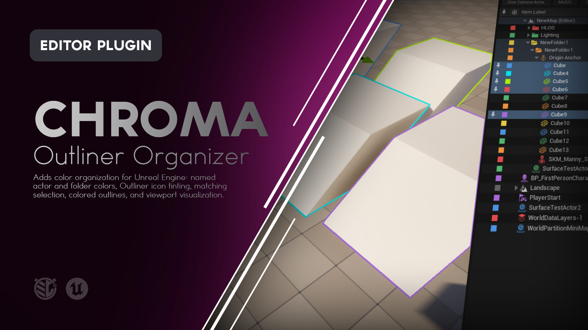
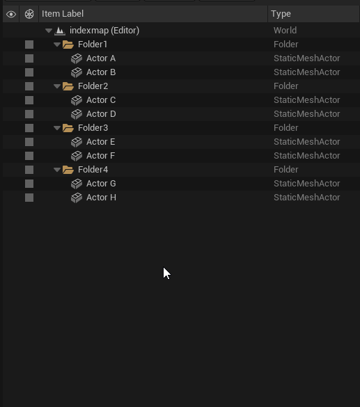
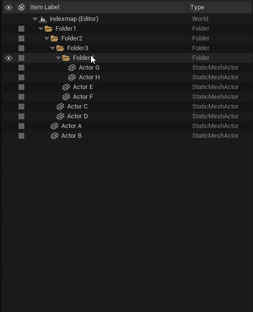
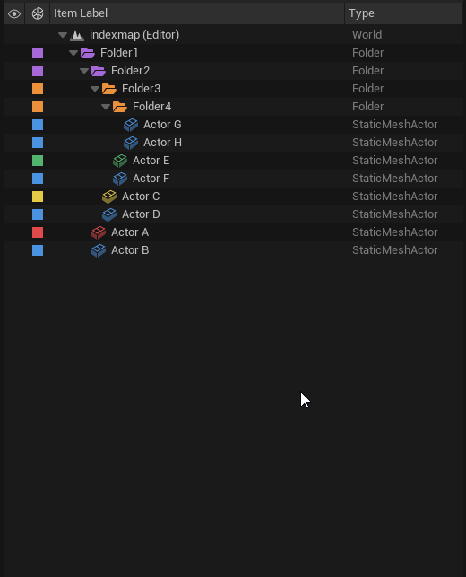
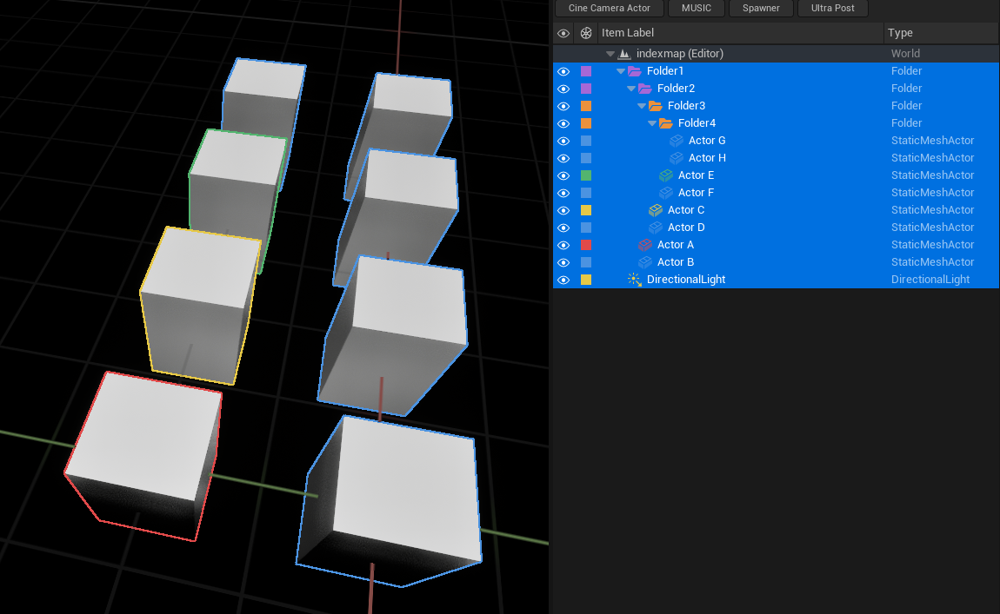
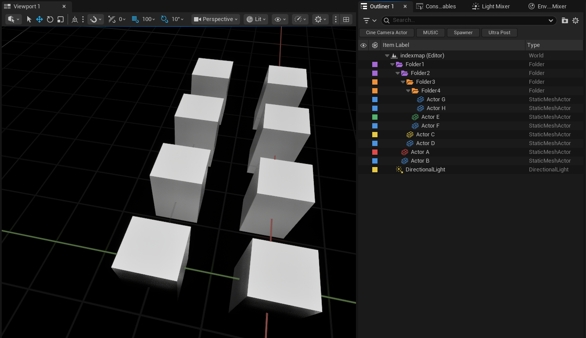
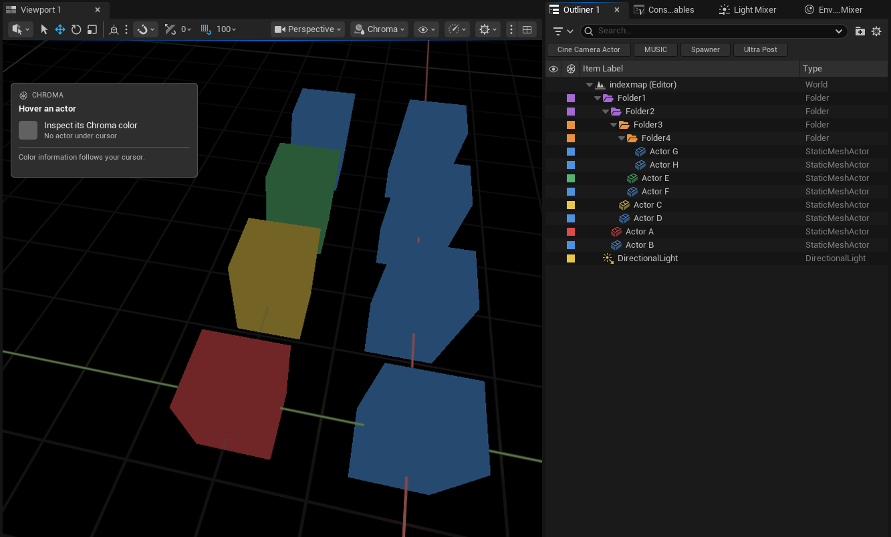
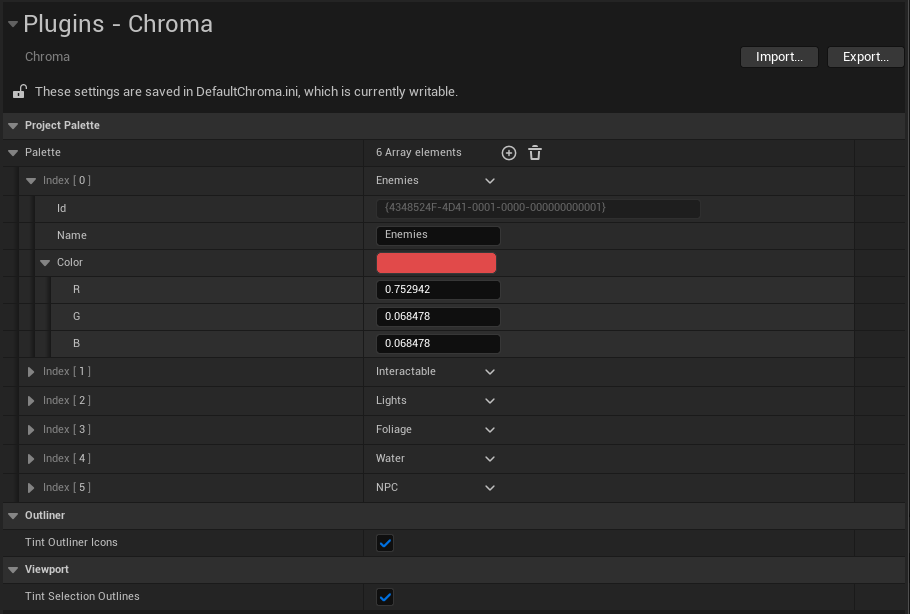

# Chroma

**Color organization for Unreal Engine's World Outliner and viewport.**

Chroma lets you assign named or custom colors to Actors and Folders, organize large levels visually, select matching groups, tint Outliner icons, color viewport selection outlines, and visualize an entire level by its Chroma assignments.



---

## What is Chroma?

Large Unreal Engine levels can contain hundreds or thousands of Actors.

Folders and naming conventions help organize them structurally, but every row in the World Outliner still tends to look visually similar.

Chroma adds another layer of organization: **color**.

Assign colors to Actors or Folders and use those colors to quickly recognize related content.

A level might use:

```text
Green   = Environment
Orange  = Gameplay
Yellow  = Lighting
Purple  = Audio
Blue    = Player
Red     = Important / Do Not Touch
```

Those colors can appear as:

- Color swatches in the World Outliner
- Tinted Actor and Folder icons
- Colored viewport selection outlines
- A dedicated viewport visualization mode

Chroma colors can also become organizational tools rather than just visual labels.

You can select every loaded item sharing a color, select matching siblings, copy and paste assignments, create named project colors, and use Folder colors as defaults for everything contained beneath them.

---

# Features

### Actor and Folder Colors

Assign colors directly to individual Actors and Folders.

### Named Project Colors

Create reusable project colors with meaningful names such as:

- Gameplay
- Lighting
- Environment
- Audio
- Critical
- Work In Progress

### Custom Colors

Assign one-off colors without creating a named project preset.

### Folder Color Inheritance

Actors and nested Folders automatically inherit the color of their containing Folder unless they define their own override.

### Automatic Inheritance for New Content

Actors added to an already colored Folder automatically inherit that Folder's color.

### Color Overrides

Give any Actor or nested Folder its own color while leaving the surrounding hierarchy unchanged.

### No Color Overrides

Explicitly prevent an Actor or Folder from inheriting the color above it.

### Mixed Selection Editing

Select multiple Actors and Folders and assign a color to the complete selection at once.

### Select Matching Color

Select loaded items sharing the same Chroma assignment.

### Select Matching Siblings

Limit matching selection to items beneath the same immediate hierarchy parent.

### Copy and Paste Colors

Copy a Chroma assignment and paste it onto another Actor, Folder, or selection.

### Used Colors

The color menu shows colors currently used by loaded items in the level for quick reuse.

### Tinted Outliner Icons

Actor and Folder icons can automatically display their effective Chroma color.

### Colored Selection Outlines

Selected Actors can use their Chroma color for their viewport selection outline.

### Chroma Viewport Visualization

Switch the viewport to **Actor Coloration > Chroma** to visualize supported level geometry entirely through its Chroma organization.

### Viewport Color Inspector

While using Chroma visualization, hover over supported Actors to see:

- Actor name
- Color name
- Hex value
- Assignment source

### Undo / Redo

Color assignment changes participate in Unreal Engine's normal Undo and Redo workflow.

### Persistent Organization

Color assignments are saved with the relevant editor packages and can persist across editor sessions.

### Editor Only

Chroma does not add runtime Actors, Components, or gameplay systems.

---



---

# Using Chroma

Chroma adds a color swatch column immediately before **Item Label** in the standard World Outliner.

Click a swatch to open the Chroma color menu.

The menu contains:

- Current Color
- Colors used in the current loaded level
- Project Palette
- Custom Color
- Color management
- Matching selection
- Copy and Paste
- Clear Override
- No Color

---

# Assigning a Color

Click the Chroma swatch beside an Actor or Folder.

Choose a color from:

### Used in This Level

Colors already used by loaded Actors or Folders.

### Project Palette

Your project's named Chroma colors.

### Custom Color

A one-off color chosen from Unreal Engine's color picker.

The item's Chroma swatch updates immediately.

If Outliner icon tinting is enabled, its icon updates as well.

---

# Working with Selections

Chroma understands the current World Outliner selection.

### Clicking a Selected Item

If the clicked row is already part of the current selection, the chosen color is applied to all compatible selected Actors and Folders.

### Clicking an Unselected Item

If the clicked row is not part of the current selection, Chroma changes only that item.

This allows both precise single-item changes and bulk color assignment without requiring separate commands.

---

## Mixed Selections

If selected items currently use different colors, Chroma displays:

**Multiple colors**

Choosing a new color replaces those assignments across the targeted selection.

---

# Folder Inheritance

Folder colors can act as defaults for everything contained beneath them.

For example:

```text
Environment                         Green
├── Architecture                    inherits Green
│   ├── Wall_A                      inherits Green
│   ├── Wall_B                      inherits Green
│   └── Door                        inherits Green
├── Props                           inherits Green
│   ├── Table                       inherits Green
│   └── Chair                       inherits Green
└── Lighting                        Yellow override
    ├── Light_A                     inherits Yellow
    └── Light_B                     inherits Yellow
```

Assigning **Green** to `Environment` automatically colors its contents.

Assigning **Yellow** to `Lighting` creates an override for that branch.

Actors added to those Folders later inherit the appropriate effective color automatically.



---

# Color Overrides

An explicitly assigned Actor or Folder color overrides inherited color.

For example:

```text
Gameplay                            Orange
├── Triggers                        inherits Orange
├── Pickups                         inherits Orange
└── CriticalObjective               Red override
```

`CriticalObjective` remains Red even though its containing Folder is Orange.

---

# Clear Override

Choose:

**Clear Override**

to remove an item's direct assignment.

The item then resumes inheriting color from its containing Folder, if one exists.

For example:

```text
Environment                         Green
└── Door                            Red override
```

Clear the override on `Door`:

```text
Environment                         Green
└── Door                            inherits Green
```

Use **Clear Override** when you want the hierarchy to determine the item's color again.

---

# No Color

**No Color** is different from Clear Override.

Clear Override means:

> Use the color inherited from above me.

No Color means:

> Do not use the color inherited from above me.

For example:

```text
Environment                         Green
└── Debug                           No Color
    ├── Marker_A                    inherits No Color
    └── Marker_B                    inherits No Color
```

The `Debug` branch explicitly blocks the Green inherited from `Environment`.

Items beneath it remain uncolored unless they receive another explicit color override.

---

# Folder Inheritance and Actor Attachments

Chroma inheritance follows **World Outliner Folder organization**.

Actor attachment relationships do not automatically transfer Chroma colors.

For example:

```text
ParentActor                         Red
└── AttachedActor
```

`AttachedActor` does not become Red merely because it is attached to `ParentActor`.

This keeps color organization based on explicit assignments and Folder structure rather than transform attachment.

---

# Named Colors

Named colors allow your project to establish a shared color vocabulary.

Open:

**Project Settings > Plugins > Chroma**

or choose:

**Edit Named Colors...**

from the Chroma palette.

Each named color contains:

- Name
- Color
- Stable internal identity

This allows colors to represent meaning rather than just appearance.

For example:

| Name | Intended Use |
|---|---|
| **Environment** | Environment art and structural content |
| **Gameplay** | Gameplay Actors and triggers |
| **Lighting** | Lighting Actors |
| **Audio** | Audio-related Actors |
| **Critical** | Important or protected content |

These names are completely project-defined.

---

# Default Project Palette

Chroma begins with six named colors:

| Name | Color |
|---|---|
| **Red** | `#E14A4A` |
| **Orange** | `#EB913C` |
| **Yellow** | `#E6C846` |
| **Green** | `#53B46F` |
| **Blue** | `#4B93E1` |
| **Purple** | `#A568D6` |

These are starting presets rather than required categories.

They can be renamed, recolored, removed, or expanded to match the needs of your project.

---

# Preset Identity

Named colors retain a stable identity separate from their visible color.

For example, imagine you create:

```text
Gameplay = Orange
```

and assign it to 100 Actors.

Later you change:

```text
Gameplay = Blue
```

Those Actors remain assigned to the **Gameplay** preset and update to Blue.

You do not need to recolor each Actor individually.

The same is true when renaming a preset.

This also means two different named presets can intentionally use the same visible RGB color while remaining separate organizational groups.

---

# Missing Presets

If a named color is deleted while Actors or Folders still reference it, those assignments become:

**Missing preset**

Chroma does not silently convert them to another color.

Reassign the affected items to a valid preset or undo the preset deletion.

This preserves the meaning of existing assignments instead of guessing what they should become.

---

# Custom Colors

Choose:

**Custom Color...**

to assign a color without creating a named project preset.

Custom colors are useful for:

- Temporary organization
- One-off markings
- Very specific visual groupings
- Cases where a reusable semantic category is unnecessary

Named presets are generally better when the color represents a recurring concept throughout the project.

---

# Used Colors

The Chroma palette includes:

**Used in This Level (loaded items)**

This section automatically collects colors currently assigned to loaded Actors and Folders.

It provides a quick way to reuse an existing level color without searching through the full project palette.

---

# Selecting by Color

Color can also be used as a selection tool.

Open a Chroma menu and choose:

**Select Matching Color**

Chroma selects matching loaded Actors and compatible Folder rows in the current editor world.

This turns color organization into a useful level-editing workflow.

For example, if every gameplay trigger is assigned:

```text
Gameplay Trigger
```

you can select all matching loaded triggers through their shared Chroma assignment.

---

## Matching Named Colors

Named colors match by **preset identity**.

Two presets can look exactly the same while still representing different groups.

For example:

```text
Gameplay = #E14A4A
Critical = #E14A4A
```

Even though they appear visually identical, Chroma still treats them as different named groups.

---

## Matching Custom Colors

Custom colors match through their stored color value.

---

# Select Matching Color Among Siblings

Choose:

**Select Matching Color Among Siblings**

to restrict matching to items sharing the same immediate World Outliner parent.

For example:

```text
Gameplay
├── Trigger_A                       Orange
├── Trigger_B                       Orange
├── Trigger_C                       Red
└── Trigger_D                       Orange
```

Sampling `Trigger_A` and selecting matching siblings selects:

```text
Trigger_A
Trigger_B
Trigger_D
```

without searching unrelated Orange items elsewhere in the level.

---

# Adding Matches to Selection

Hold:

**Shift**

while invoking either matching-selection command to add matching items to the existing selection instead of replacing it.

---



---

# Copy and Paste

Chroma assignments can be copied between items.

Choose:

**Copy Chroma Color**

from the source item.

Then select the destination and choose:

**Paste Chroma Color**

Copy and Paste preserve the assignment type.

That means a named preset remains that named preset rather than being converted into an unrelated custom RGB color.

Paste follows the same selection targeting rules as normal Chroma assignment.

---

# Actor Context Menu

Chroma commands are also available when right-clicking compatible Actors.

Use:

**Chroma > Color and Selection**

This provides access to common color and selection actions without requiring the Actor's World Outliner swatch.

For Folder color assignment, use the Chroma swatch directly in the World Outliner.

---

# Tinted Outliner Icons

By default, Chroma applies effective colors to compatible native Actor and Folder icons.

For example:

```text
Environment                         [Green Folder Icon]
├── Wall_A                          [Green Actor Icon]
├── Wall_B                          [Green Actor Icon]
└── Lighting                        [Yellow Folder Icon]
    └── PointLight                  [Yellow Actor Icon]
```

Inherited colors tint icons the same way as direct assignments.

Uncolored items retain their normal presentation.

This can be disabled under:

**Project Settings > Plugins > Chroma > Outliner**

using:

**Tint Outliner Icons**

---

# Colored Selection Outlines

Chroma can apply an Actor's effective color to its normal viewport selection outline.

For example:

- Select a Green environment Actor and receive a Green outline.
- Select an Orange gameplay Actor and receive an Orange outline.
- Select both and each can retain its own Chroma outline color.

This makes color organization visible while working directly inside the level viewport.

The feature is enabled by default.

Open:

**Project Settings > Plugins > Chroma > Viewport**

and use:

**Tint Selection Outlines**

to enable or disable it.



---

## Selection Outline Color Limit

Chroma can display up to **six distinct Chroma selection-outline colors simultaneously**.

If more than six unique Chroma colors are selected at once, additional colors use Unreal Engine's normal selection outline until a color slot becomes available.

Actors sharing the same displayed Chroma color also share the same outline-color slot.

Existing explicitly assigned selection-outline color slots are respected and can reduce the number available to Chroma.

---

# Chroma Viewport Visualization

Chroma includes a dedicated Unreal Engine Actor Coloration mode.

Open the viewport's view-mode menu, normally labeled:

**Lit**

Then choose:

**Actor Coloration > Chroma**

Supported geometry is displayed using its effective Chroma color.

For example:

```text
Environment     -> Green
Gameplay        -> Orange
Lighting        -> Yellow
Audio           -> Purple
Unassigned      -> Neutral Gray
```

This provides a level-wide visualization of your organizational structure.

| Lit View | Chroma Visualization |
|---|---|
|  |  |

---

# Viewport Color Inspector

While **Actor Coloration > Chroma** is active, Chroma displays a small information panel in the upper-left corner of the viewport.

Hover supported Actor geometry to inspect:

- Actor name
- Named or custom color
- Hex color value
- Assignment source

For example:

```text
CHROMA

BP_Door_04

Environment
#53B46F

Inherited from Environment/Architecture
```

The panel can distinguish between:

- Direct assignments
- Inherited Folder colors
- No Color overrides
- Missing presets
- Unassigned Actors

The panel does not intercept viewport clicks.

During camera navigation, drag operations, or open menus, it temporarily holds its last result and resumes updating when normal hovering returns.

---

# Visualization Behavior

Chroma visualization changes how supported Actor geometry is displayed in the editor viewport.

It does **not**:

- Replace materials
- Modify saved materials
- Modify Actor visibility
- Change runtime rendering
- Change packaged-game visuals

Return the viewport to:

**Lit**

to restore its normal view.

Empty Actors and Folders have no rendered geometry to recolor.

---

# Project Settings

Open:

**Project Settings > Plugins > Chroma**

to configure Chroma.

The settings contain three main areas.

### Project Palette

Create and manage named project colors.

Each entry contains:

- Name
- Color

### Outliner

**Tint Outliner Icons**

Enabled by default.

Controls whether compatible Actor and Folder icons display their effective Chroma colors.

### Viewport

**Tint Selection Outlines**

Enabled by default.

Controls whether selected Actors use Chroma-colored selection outlines.



---

# Example Workflow

Imagine you're organizing a large gameplay level.

Your World Outliner contains:

```text
Environment
Gameplay
Lighting
Audio
Cinematics
Debug
```

Create a named project palette:

```text
Environment     Green
Gameplay        Orange
Lighting        Yellow
Audio           Purple
Cinematics      Blue
Critical        Red
```

Then:

1. Assign Green to the `Environment` Folder.
2. All Environment Actors inherit Green automatically.
3. Assign Orange to `Gameplay`.
4. Assign Yellow to `Lighting`.
5. Give a critical gameplay Actor a Red override.
6. Use **No Color** for utility content you deliberately do not want categorized.
7. Select an Orange Actor and use **Select Matching Color** when you need all loaded Gameplay items.
8. Switch to **Actor Coloration > Chroma** when you want to visually audit the organization of the complete scene.
9. Hover questionable Actors to see where their color came from.

The hierarchy still describes **where things live**.

Names describe **what things are**.

Chroma provides another layer describing **what group they belong to**.

---

# Saving Chroma Organization

Chroma color assignments are stored as editor package metadata.

Depending on the type of item and project configuration, that metadata lives with the relevant:

- Actor package
- Folder package
- Level package

Named project colors and Chroma settings are stored through the project's Chroma configuration.

After changing color assignments, save the affected level or Actors using your normal Unreal Engine workflow:

**File > Save**

or:

**File > Save All**

Chroma does not create custom Actor or Component classes inside your level.

---

# Team Projects

Chroma organization can be shared through a team's normal source-control workflow.

For shared color organization, include:

- The affected map packages
- Relevant external Actor packages
- Relevant external Folder packages
- `Config/DefaultChroma.ini`

Keep changes to named project colors together with assignments that depend on those colors.

Chroma does not automatically:

- Check out files
- Submit files
- Sync files
- Resolve source-control conflicts

It stores the organization.

Your existing source-control workflow remains responsible for distributing it.

---

# Installation

Chroma can be installed through **Fab**, from a **precompiled GitHub Release**, or directly from the **GitHub source**.

For most users, the Fab or GitHub Release installation is recommended.

---

## Fab / Epic Games Launcher

> **Availability:** Use this installation method once Chroma is available through Fab.

1. Add **Chroma** to your library on Fab.
2. Open the **Epic Games Launcher**.
3. Navigate to your Unreal Engine Library.
4. Locate Chroma in your Fab / Vault library.
5. Install Chroma to the supported Unreal Engine version.
6. Launch your Unreal Engine project.
7. Open **Edit > Plugins**.
8. Search for **Chroma**.
9. Enable the plugin if it is not already enabled.
10. Restart Unreal Editor if prompted.

Once enabled, the Chroma column will appear in the standard World Outliner.

---

## GitHub Release

> [!NOTE]
> Precompiled GitHub packages will appear on the repository's **Releases** page when available.

### 1. Download Chroma

Open the repository's Releases page:

https://github.com/mippi-the-dork/Chroma/releases

Download the packaged plugin matching your Unreal Engine version and platform.

For example:

```text
Chroma-v1.0.1-UE5.8.2-Win64.zip
```

Do not use GitHub's automatically generated **Source code** ZIP as a precompiled plugin package.

### 2. Close Unreal Editor

Close the project before installing the plugin.

### 3. Locate Your Project Plugins Folder

Your project should contain a `Plugins` directory beside the `.uproject` file:

```text
YourProject/
├── Config/
├── Content/
├── Plugins/
└── YourProject.uproject
```

If the `Plugins` directory does not exist, create it.

### 4. Extract Chroma

Extract the `Chroma` folder into:

```text
YourProject/Plugins/
```

The final structure should look similar to:

```text
YourProject/
├── Plugins/
│   └── Chroma/
│       ├── Config/
│       ├── Doc/
│       ├── Resources/
│       ├── Source/
│       └── Chroma.uplugin
└── YourProject.uproject
```

### 5. Launch the Project

Open your Unreal Engine project.

If necessary, navigate to:

**Edit > Plugins**

Search for:

```text
Chroma
```

Enable the plugin and restart Unreal Editor if prompted.

---

## GitHub Source

Developers who want the source or want to modify Chroma can clone the repository directly.

### Requirements

Building Chroma from source requires a working Unreal Engine C++ development environment.

For Windows this generally means:

- Unreal Engine 5.8.x
- Visual Studio with the appropriate C++ workloads
- A project capable of compiling C++ plugins

### Clone the Repository

Close Unreal Editor and navigate to your project's `Plugins` directory.

```bash
cd YourProject/Plugins
git clone https://github.com/mippi-the-dork/Chroma.git
```

Your project should now contain:

```text
YourProject/Plugins/Chroma/
```

### Generate Project Files

If necessary:

1. Right-click your `.uproject`.
2. Select **Generate Visual Studio project files**.

Then open the generated solution and build your project's Editor target.

For example:

```text
YourProjectEditor
Win64
Development Editor
```

Launch the project after compilation completes.

---

# Updating Chroma

## GitHub Release Installation

When updating a manually installed release:

1. Close Unreal Editor.
2. Remove the existing `Plugins/Chroma` folder.
3. Extract the new Chroma release into the `Plugins` directory.
4. Reopen the project.

Replacing the complete plugin folder is recommended rather than copying individual files over an older version.

Your color assignments are stored with the project content rather than inside the installed plugin directory.

---

## Git Source Installation

If you cloned the repository using Git:

```bash
cd YourProject/Plugins/Chroma
git pull
```

Rebuild the project if the source has changed.

---

# Compatibility

The current Chroma version targets:

| | |
|---|---|
| **Chroma Version** | 1.0.1 |
| **Unreal Engine** | 5.8.x |
| **Tested Version** | 5.8.2 |
| **Platform** | Windows 64-bit |
| **Plugin Type** | Editor |
| **Runtime Dependency** | None |
| **Runtime Actors** | None |
| **Runtime Components** | None |
| **Packaged Game Impact** | None |

Chroma's plugin descriptor targets Unreal Engine 5.8.0, with the current version tested in Unreal Engine 5.8.2.

Compatibility with additional Unreal Engine versions or platforms should not be assumed unless explicitly listed in a release.

---

# How Chroma Works

Chroma stores a lightweight color assignment rather than modifying an Actor's native rendering or materials.

An assignment can represent:

- A named project preset
- A custom RGB color
- An explicit No Color state
- No direct assignment

When Chroma determines an Actor's effective color:

1. It checks the Actor for a direct assignment.
2. If none exists, it checks the containing Folder.
3. If that Folder has no assignment, Chroma continues upward through the Folder hierarchy.
4. The first applicable assignment becomes the effective color.
5. A direct override or No Color state stops that inheritance.

Named colors reference a stable preset identity rather than storing only the visible RGB value.

That allows a preset to be renamed or recolored while existing assignments continue referring to the same logical group.

---

# What Chroma Does Not Do

Chroma is an **editor organization and visualization tool**.

It does not:

- Change Actor materials
- Replace materials
- Add runtime color data
- Change packaged-game visuals
- Add runtime Actors
- Add runtime Components
- Change Actor visibility
- Change Actor attachments
- Move Actors between Folders
- Change Folder hierarchy
- Automatically determine what colors your project should use
- Transfer color through Actor attachment relationships
- Replace Unreal Engine's normal selection system

Chroma adds organizational meaning without changing the gameplay content being organized.

---

# Limitations

### Loaded Content

Chroma operates on loaded editor Actors and Folders.

Unloaded World Partition Actors are not included in:

- Color editing
- Color matching
- Outliner icon tinting
- Used-color collection

Load the required Actors before working with them.

### Outliner Filters

Matching Actors can still be selected when filtered from the visible Outliner.

Filtered Folder rows cannot always be safely selected while hidden.

If matching Folders are excluded by the current Outliner filter, Chroma displays a notification asking you to clear the filter.

### PIE and Simulation

Chroma editing and viewport organization tools target the normal editor workflow.

They are not intended as gameplay or PIE visualization systems.

### Selection Outlines

Colored selection outlines have a limited number of simultaneous color slots.

Chroma supports up to six distinct colors at once when those slots are available.

### Render Types

Selection-outline behavior has been tested primarily with standard Static Mesh and Nanite geometry.

Specialized rendering paths, translucent geometry, Landscapes, and per-instance editing may behave differently and require additional validation.

### Icon Tinting

Chroma preserves the standard Actor and Folder label workflow and tints compatible native icons.

Custom icon artwork that already contains strong baked-in colors may produce a different visual result when tinted.

Custom Outliner label implementations may not provide a compatible icon for Chroma to tint.

### Viewport Visualization

Only supported rendered Actor geometry can display Actor Coloration.

Folders and empty Actors contain no geometry to recolor.

---

# Troubleshooting

## The Chroma Column Does Not Appear

Check:

**Edit > Plugins**

Search for:

```text
Chroma
```

Confirm that the plugin is enabled.

Restart Unreal Editor if it was just enabled.

---

## An Actor Has a Color I Did Not Assign Directly

The Actor may be inheriting its color from a containing Folder.

Click its Chroma swatch.

The current color information identifies inherited assignments and their source.

Use:

**Clear Override**

to resume inheritance after a direct assignment.

Use:

**No Color**

to explicitly block inheritance.

---

## Clearing a Color Makes Another Color Appear

This is expected if the Actor or Folder is inside a colored Folder.

**Clear Override** removes the direct assignment and resumes Folder inheritance.

Choose:

**No Color**

if you want the item to remain explicitly uncolored.

---

## Changing a Named Color Changed Many Actors

Named project colors use shared preset identities.

Changing a preset's color intentionally updates everything assigned to that preset.

Use a different named preset or Custom Color if you need an independent color.

---

## A Preset Says Missing Preset

The named color referenced by that assignment has been removed from the project palette.

Reassign the Actor or Folder to a valid color, or undo the preset deletion.

---

## Selection Outlines Are Not Colored

Check:

**Project Settings > Plugins > Chroma > Viewport**

and make sure:

**Tint Selection Outlines**

is enabled.

Also make sure Unreal Engine's normal viewport selection outlines are visible.

---

## Some Selected Actors Use the Normal Unreal Outline

Chroma can display up to six distinct Chroma outline colors simultaneously when the required outline slots are available.

Additional unique colors use Unreal Engine's normal selection outline.

---

## Outliner Icons Are Not Colored

Check:

**Project Settings > Plugins > Chroma > Outliner**

and make sure:

**Tint Outliner Icons**

is enabled.

Unassigned and No Color items intentionally retain their normal appearance.

---

## Select Matching Color Missed a Folder

Check whether the World Outliner currently has a search or filter applied.

Clear the filter and run the command again.

Filtered Folder rows cannot always be safely selected while hidden.

---

## Chroma Visualization Is Not Active

Open the viewport view-mode menu and choose:

**Actor Coloration > Chroma**

Make sure the viewport is using the Chroma Actor Coloration mode rather than Lit or another visualization mode.

---

## An Actor Appears Gray in Chroma Visualization

Neutral gray indicates that Chroma does not currently have an effective display color for that Actor.

Possible reasons include:

- No direct assignment
- No inherited Folder assignment
- An explicit No Color override
- A missing named preset

Hover the Actor to inspect its current Chroma state.

---

# Reporting Bugs

If you encounter a problem, please open an issue:

https://github.com/mippi-the-dork/Chroma/issues

When reporting a bug, include:

- Chroma version
- Unreal Engine version
- Windows version
- Whether Chroma was installed from Fab, a GitHub Release, or source
- Whether the affected item is an Actor or Folder
- Whether the color is direct or inherited
- Whether World Partition is involved
- Whether the issue affects the Outliner, selection outlines, or Actor Coloration
- Steps to reproduce the problem
- Screenshots or video when relevant
- Any relevant Unreal Editor log output

For inheritance problems, a small text representation of the affected Folder hierarchy can be especially useful.

---

# Feature Requests

Suggestions and feature requests are welcome through GitHub Issues.

When proposing a feature, describe the organization or visualization problem you're trying to solve rather than only the implementation you would like to see.

That makes it easier to determine whether the feature belongs in Chroma and whether there may be a simpler solution.

---

# Contributions

Pull requests are welcome.

If you're considering a significant change, opening an Issue first is recommended so the intended behavior can be discussed before substantial work is done.

Chroma is intended to remain focused on color-based editor organization, selection, and visualization.

---

# License

Chroma is distributed under the **MIT License**.

See [`LICENSE`](LICENSE) for details.

---

# About

Chroma is an Unreal Engine editor utility created by **Mippi the Dork**.

The plugin was built around a simple idea:

> A large hierarchy becomes much easier to understand when organization is something you can see.

Chroma adds color as another layer of information without changing the content being organized.
